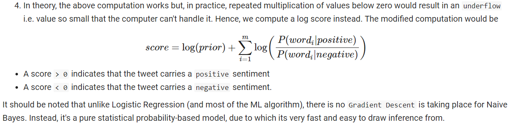

# Tweet Sentiment Detection


### Detect if the tweet is positive or negative


## Table of Contents

- [Introduction](#introduction) 
- [Data Preprocessing](#data-preprocessing)
- [Logistic Regression](#logistic-regression)
- [Naive Bayes Classifier](#naive-bayes-classifier)
- [Test Models](#test-models)
- [License](#license)
- [Author Info](#author-info)

---

## Introduction

We try to detect the `sentiment`, positive or negative, carried by a tweet in this project. We use two of the simplest but very effective classification algorithms... 

a) Logistic Regression  
b) Naive Bayes

Broadly, the solution is divided into four parts…
1) Preprocessing
2) Building and training Logistic Regression
3) Building and training Naive Bayes 
4) Testing the trained models

---

## Data Preprocessing

### Dataset
We make use of the NLTK provided `tweet_samples` dataset. It's a balanced dataset with 5000 samples of positive labeled raw tweets and 5000 samples of negative labeled raw tweets. Data is split into `train` and `test` set in 80:20 ratio.

### Data Cleaning
Data preprocessing is a fundamental task for any machine-learning project. Especially, text data is highly unstructured and needs a lot of cleaning and formatting before it can be used for modeling. 
Tweets go through the below listed data-cleaning steps...  
  1) Remove tweet handle, remove symbols (#, '$')
  2) Remove hyperlinks for the tweets
  4) Convert tweets to lower-case
  5) Break tweets into word `tokens.`
  5) Get rid of punctuation tokens
  6) Get rid of English stop-words tokens
  7) Stem each token
  
### Data Encoding
Once we have a clean set of data samples in the form of word tokens, it needs to be encoded into numeric features before feeding it to our models.

* Count and store the number of times a word in the dataset appears in positive tweets (pos_frequency)  
* Count and store the number of times a word in the dataset appears in negative tweets (neg_frequency)
* For `Logistic Regression.`  
Convert each tweet into a data-point with three features  
     1) bias, always set to 1
     2) sum of pos_freqeuncy of all word tokens in the tweet
     3) sum of neg_freqeuncy of all word tokens in the tweet
* `Naive Bayes` does not need above-encoded tweets; instead Naive Bayes model will compute log-likelihood from tweet tokens and the pos_frequency, neg_frequency dictionary computed above.

## Logistic Regression
Logistic regression is a statistical model pre-dominantly used for binary classification problems. Logistic regression relies on `logistic function` a single variable(feature) logistic function is shown below


---

## Naive Bayes Classifier


The Naive Bayes is based on the Bayes theorem, but it makes an unrealistic assumption (hence naive) that the events are independent of each other which is hardly a case in real life. Despite this, surprisingly, it performs very well for many problems such as email spam detection, text sentiment analysis, etc.




---
 
## Test Models

* Create couple of tweet strings (or copy a real tweet), one with positive sentiment and other with negative sentiment
* Logistic Regression: call utils.predict function as shown below
  ```python
  sentiment = utils.get_sentiment(positive_test_tweet, lr_model, encode_tweet=True)
  ```
  
  `sentiment` would be returned as 'POSITIVE' for the positive tweet and 'NEGATIVE' for the negative tweet. Note that the `encode_tweet` parameter is set to `True` to ensure that tweet tokens are encoded into features for Logistic Regression.
* Naive Bayes: call utils.predict function as shown below
  ```python
  sentiment = utils.get_sentiment(positive_test_tweet, lr_model, encode_tweet=False)
  ```
  
  `sentiment` would be returned as 'POSITIVE' for the positive tweet and 'NEGATIVE' for the negative tweet. Note that the `encode_tweet` parameter is set to `False` in this case; this is to ensure that tweet tokens are used for the Naive Bayes model.

---

## License

MIT License

Copyright (c) [2022] [Sunil S. Singh]

Permission is hereby granted, free of charge, to any person obtaining a copy
of this software and associated documentation files (the "Software") to deal
in the software without restriction, including without limitation the rights
to use, copy, modify, merge, publish, distribute, sublicense, and/or sell
copies of the software, and to permit persons to whom the software is
furnished to do so, subject to the following conditions:

The above copyright notice and this permission notice shall be included in all
copies or substantial portions of the software.

THE SOFTWARE IS PROVIDED "AS IS", WITHOUT WARRANTY OF ANY KIND, EXPRESS OR
IMPLIED, INCLUDING BUT NOT LIMITED TO THE WARRANTIES OF MERCHANTABILITY,
FITNESS FOR A PARTICULAR PURPOSE AND NON-INFRINGEMENT. IN NO EVENT SHALL THE
AUTHORS OR COPYRIGHT HOLDERS BE LIABLE FOR ANY CLAIM, DAMAGES, OR OTHER
LIABILITY, WHETHER IN AN ACTION OF CONTRACT, TORT OR OTHERWISE, ARISING FROM,
OUT OF OR IN CONNECTION WITH THE SOFTWARE OR THE USE OR OTHER DEALINGS IN THE
SOFTWARE.

---

## Author Info

- Twitter - [@_sssingh](https://twitter.com/_sssingh)
- Linkedin - [Sunil S. Singh](https://linkedin.com/in/sssingh)

[Back To The Top](#Tweet-Sentiment-Detection)

---